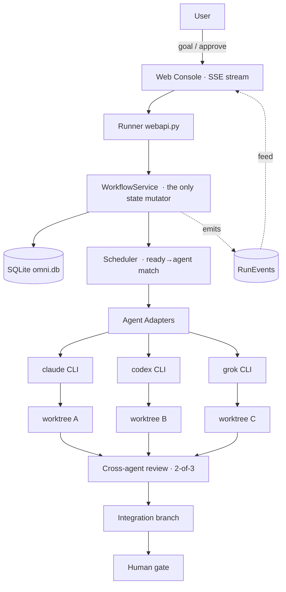

# Omni — Architecture & Design

**Omni** turns three logged-in agent CLIs (Claude, Codex, Grok) into one small
engineering team: a deterministic coordinator hands each agent a scoped task in
its own git worktree, the agents review each other's commits, and nothing
reaches `main` until a human approves. A Claude-CLI-style web console streams
every line of work live.

> Status at a glance: the coordinator, worktree isolation, cross-agent review,
> revision loop, integration, human gate, streaming console, **auto-planning**, and
> **Local/Cloud modes** are built and tested. The real-CLI path is now **validated
> live** — a Cloud Omni run added the Cydonia SillyTavern artifacts to a real repo
> hands-off (3 tasks → cross-review → integrate → human gate → merge). See [Status](#status--build-order).

---

## 1. Design principles

1. **The coordinator controls state; agents only do work.** All workflow state
   transitions live in ordinary, deterministic Python (`WorkflowService`). The
   LLM agents decide *how* to implement, what to test, and whether code looks
   correct — never *what is ready*, *who owns it*, or *when review starts*. This
   is the single most important rule: it stops the system from becoming three
   models trying to coordinate themselves through conversation.
2. **No new agent framework.** The agents are the existing CLIs. One thin
   adapter layer normalizes them; the engine never cares which CLI is underneath.
3. **Isolation by git, not containers.** Each assignment runs in its own
   `git worktree`, so agents modify the same repo concurrently without collision.
4. **Reviews are facts about a commit.** A review is pinned to a commit SHA, so a
   later change automatically invalidates stale approvals.
5. **Smallest state that works.** Six entities on SQLite. No Kafka/Redis/Temporal,
   no event-sourcing, no graph DB.
6. **Backward compatible / modular.** The workflow engine sits *above* the
   original single-harness layer; `harnesses.yaml` remains the one place a
   provider is added or tuned.

### Adaptations from the original plan

The source plan assumed an "Omnigent server + containers + sessions" substrate
Omni doesn't have. Grounded adaptations:

| Plan assumption | Omni reality |
|---|---|
| Agents run in **containers** | Agents run as **subprocesses** in a git **worktree** (`cwd`) |
| Omnigent **`session_id`** per assignment | The workflow **DB row** is the state (column left nullable) |
| `ClaudeAdapter`/`CodexAdapter`/`GrokAdapter` | **One `CliAgentAdapter`** parameterized by harness (they'd be identical; `harnesses.yaml` holds the per-agent config) |
| Agent returns structured JSON result | Coordinator **derives** the result from git (commit SHA, files changed) — deterministic, not dependent on the CLI emitting clean JSON |

---

## 2. System overview



The coordinator (left) owns sessions and state; the agents (middle) execute in
isolated worktrees; review → integration → human gate close the loop. Every
state change is emitted as a `RunEvent` and streamed to the console.

---

## 3. Data model (6 entities, SQLite)

`omnigent/workflow/models.py` — plain relational tables via stdlib `sqlite3`
(dict rows, JSON columns for list fields). Portable to Postgres later.

| Entity | Purpose | Key fields |
|---|---|---|
| **Project** | A repo Omni operates on | `repo_path`, `default_branch`, `test_command` |
| **Run** | One user goal | `goal`, `status`, `base_branch`, `integration_branch` |
| **Task** | A unit of work in a run | `title`, `status`, `depends_on[]`, `acceptance_criteria[]`, `ownership[]`, `assigned_agent`, `revisions` |
| **Assignment** | One agent doing one task | `agent`, `role`, `status`, `worktree_path`, `branch`, `commit_sha`, `files_changed`, `tokens_in/out`, `cost_usd` |
| **Review** | One reviewer's verdict on a commit | `reviewer_agent`, `reviewed_commit_sha`, `verdict`, `findings[]` |
| **RunEvent** | Append-only activity log | `event_type`, `agent`, `task_id`, `payload`, `created_at` |

`Store.on_event` is a single hook the web layer subscribes to for live streaming.
**No duplication of runtime state** — the DB holds workflow state only.

### State machines

**Run:** `PLANNING → RUNNING → REVIEWING → INTEGRATING → WAITING_FOR_USER → COMPLETED`
(plus `FAILED`, `CANCELLED`).

**Task:**

```
PLANNED → READY → RUNNING → REVIEW_READY → REVIEWING → APPROVED
                     ▲                          │
                     └──────── RUNNING ◄─── CHANGES_REQUESTED   (revision loop)
                     └────────────────────────► FAILED
```

**Assignment:** `ASSIGNED → RUNNING → DONE | FAILED | CANCELLED`.
**Review verdict:** `APPROVED | CHANGES_REQUESTED | BLOCKED`.

---

## 4. Components

```
omnigent/
├── harnesses.yaml          # the seam: one entry per agent CLI (bin, args, detect)
├── harness.py              # Harness registry + streaming subprocess runner
├── router.py, core.py      # single-harness routing (original layer)
├── cli.py                  # `omnigent list | run | repl | web`
├── web.py                  # Claude-CLI-style console (Starlette) + SSE
└── workflow/
    ├── models.py           # 6 entities + SQLite Store + state constants
    ├── worktrees.py        # WorktreeManager (branch + worktree, safety)
    ├── adapter.py          # AgentAdapter, CliAgentAdapter, MockAgentAdapter,
    │                       #   contract_prompt(), review_prompt(), usage/verdict parse
    ├── service.py          # WorkflowService (sole state mutator) + scheduler + drive()
    └── webapi.py           # Runner (bg drive + per-run feed) + API routes + SSE
```

### 4.1 Agent adapters (`adapter.py`)

A uniform interface: `run(task, worktree, base, on_line)` → `AgentResult`, and
`review(task, diff, commit, on_line, cwd)` → `ReviewResult`.

- **`CliAgentAdapter`** wraps `harness.run` (streams stdout line-by-line), then
  derives the commit SHA and changed-file count from git. Best-effort token/cost
  scrape via `_parse_usage` (populated when a CLI emits usage JSON).
- **`MockAgentAdapter`** writes a file + commits, and reviews `APPROVED` — no LLM.
  Makes the whole coordinator testable **fast, free, and deterministically**.
- Task work is driven by a **Task Contract** (`contract_prompt`): goal, ownership
  (paths to modify), do-not-modify, acceptance criteria, validation command, and
  "commit your work." Reviewers get a **narrow read-only contract** (`review_prompt`):
  inspect the diff against the criteria, reply `VERDICT: APPROVED|CHANGES_REQUESTED`.

### 4.2 Worktree isolation (`worktrees.py`)

Per assignment: `git worktree add -b task/<slug>-<agent> <.worktrees/<run>/<name>>`
off the run's integration branch. The agent's subprocess runs with that dir as
`cwd`. Removal checks for uncommitted work first. **Worktree creation is
serialized** by the coordinator (git's worktree index isn't concurrency-safe);
**agent execution is parallel**.

### 4.3 WorkflowService (`service.py`) — the coordinator

The only code allowed to change state. Key operations:

- `create_project / create_run / create_task` — a run creates its integration
  branch off `base`.
- `ready_tasks` — PLANNED/READY tasks whose `depends_on` are all APPROVED (a
  simple DAG scheduler).
- `assign` (serial) + `execute_assignment` (parallel) — worktree then agent.
- `request_reviews` — dispatch the **other two** agents against the commit (§ review matrix).
- `evaluate_task` — consensus: any `CHANGES_REQUESTED` wins; else **≥2 APPROVED → APPROVED**.
  Only reviews pinned to the *current* commit count.
- `revise_task` — re-run the implementer in the **same worktree** with the
  aggregated findings; new commit → REVIEW_READY; old reviews go stale automatically.
- `integrate_run` — merge approved task branches into the integration branch in a
  dedicated worktree; **conflicts are surfaced, never auto-resolved**; optional
  repo-level validation (`test_command`). **Stops before `main`.**
- `approve_run` — the human gate → COMPLETED.
- `drive()` — orchestrates the whole loop: execute → review → revise → integrate → gate.

### 4.4 Web console + streaming (`webapi.py`, `web.py`)

- **`Runner`** drives runs on background threads and funnels *everything* — agent
  output lines (`on_line`) and state events (`Store.on_event`) — into one per-run
  **feed**, streamed to the browser over **SSE** (`sse_starlette`).
- **Demo mode** runs mock agents in a throwaway repo — instant, free, safe.
- The **UI** is a warm-dark, Claude-CLI-mimic console: left sidebar
  (runs / tasks / agents), a big scrolling **transcript** (mono, agent-colour-coded
  lines + dim event lines), a small **chat box** at the bottom, and a live
  **↑in ↓out · $cost** readout. Reviewed for contrast (AA), focus-visible, and
  offline handling.

### API surface

```
GET  /api/state                 projects + runs
POST /api/runs                  {goal, project_path, mock, tasks?} → start a run
GET  /api/runs/{id}             snapshot (run + tasks + assignments + reviews + summary)
GET  /api/runs/{id}/stream      SSE feed (agent output + events + done summary)
POST /api/runs/{id}/approve     human gate
GET  /harnesses                 agent availability
```

---

## 5. The review model

```
IMPLEMENTER     REVIEWERS (read-only)
codex           claude + grok      ← cloud default (CLOUD_IMPL: codex primary, grok second)
grok            claude + codex
claude          codex + grok       (claude is reserved as a reviewer in cloud mode)
```

In **cloud mode** codex is the primary implementer and claude stays a reviewer
(`CLOUD_IMPL = ["codex", "grok"]`); reviewers are always `AGENTS` minus the implementer.
Two independent external reviews per task; **2-of-3 approval** required. Because a
review is pinned to a `reviewed_commit_sha`, revising the code makes prior
approvals stale by construction — no manual invalidation. This is what keeps
cross-agent review deterministic instead of a debate.

---

## 6. Why this is token/cost efficient

- **Flat-rate parallelism.** The agents are driven by flat-rate CLI subscriptions,
  not metered per-token APIs — three plans working in parallel cost the same idle
  or busy.
- **Small, scoped context per call.** Each agent gets one tight Task Contract in
  its own worktree, not one mega-prompt holding the whole codebase.
- **Zero tokens on coordination.** The coordinator is plain code; no tokens are
  spent on models "managing" the workflow through conversation.
- **Review is cross-model.** A *different* subscription checks the work, instead
  of paying one expensive model to grade its own homework.

---

## 7. Status & build order

| # | Piece | State |
|---|---|---|
| 1–2 | Agent adapter interface + adapters | ✅ built (`CliAgentAdapter`; real path unvalidated live) |
| 3–6 | Project / Run / Task / Assignment models + SQLite | ✅ built + tested |
| 7 | Scheduler (ready → available agent) | ✅ built |
| 8 | Git worktree manager | ✅ built + tested |
| 9–10 | Parallel execution + structured result | ✅ built + tested |
| 11–12 | Review model + cross-agent review | ✅ built + tested |
| 13 | Revision loop | ✅ built + tested |
| 14–15 | Integration branch + validation | ✅ built + tested |
| 16 | Human approval gate | ✅ built + tested |
| 17 | RunEvent stream (SSE) | ✅ built + tested |
| 18 | Minimal console UI (CLI-style) | ✅ built + design-reviewed |
| 19 | **Automatic planning** (goal → task DAG) | ✅ built (`planner.py`; cloud lead splits goal, single-task fallback) |
| 19b | **Local/Cloud modes** (local agents implement, cloud reviews) | ✅ built (`runs.mode`, `CLOUD_IMPL`/`LOCAL_IMPL`) |
| 20 | Workflow graph UI (React Flow) | ⬜ deferred until live state justifies it |

**Tests:** `test_workflow.py` (full loop: 3 tasks → 6 reviews → integration →
gate → completed; revision loop: stale review dropped, re-approved on fresh
commit), `test_router.py`, `python -m omnigent.harness`.

### Honest gaps / next steps

1. **Validate the live-CLI path end-to-end** — a real run on a small repo. Mock
   proves the coordinator; this proves the agents (reliably committing is the risk).
2. **Automatic planning** — three agents propose plans, a lead synthesizes a task
   DAG (§ plan phase 7). Until then, tasks are created explicitly.
3. **True live token streaming** — parse each CLI's stream-json usage for a live
   Claude-CLI-style token/cost meter (currently best-effort / synthetic in mock).
4. **Real read-only sandbox for reviewers** — today enforced by prompt + intent;
   later by OS/sandbox policy.

---

## 8. Running it

```bash
pip install -e .            # or: just setup
omnigent web                # http://127.0.0.1:8770  (or the desktop launcher)
python test_workflow.py     # prove the coordinator with mock agents
```

In the console: type a goal, keep **demo** checked for an instant free run, and
watch the agents plan → build → review → integrate, streaming CLI-style. Uncheck
demo and give a real git repo path to drive your actual CLIs.

## 9. Console activity pipeline

Raw harness lines are sanitized and normalized into semantic activity records before
they reach the browser. The in-memory SSE feed is capped at 5,000 records and initial
replay at 800; full audit output is appended to paged JSONL transcripts under
`~/.omni/transcripts`. The browser renders task/activity compartments in animation-frame
batches, deduplicates by sequence, caps detail nodes, and loads older history only on demand.

Task creation preserves ownership, forbidden paths, validation, priority, and dependencies.
The coordinator rejects no-op, dirty, and out-of-scope implementations before cloud review.
Capacity-limited reviewers abstain without stopping remaining reviewers, and fatal driver
errors now finish the run explicitly instead of leaving a false active state.
